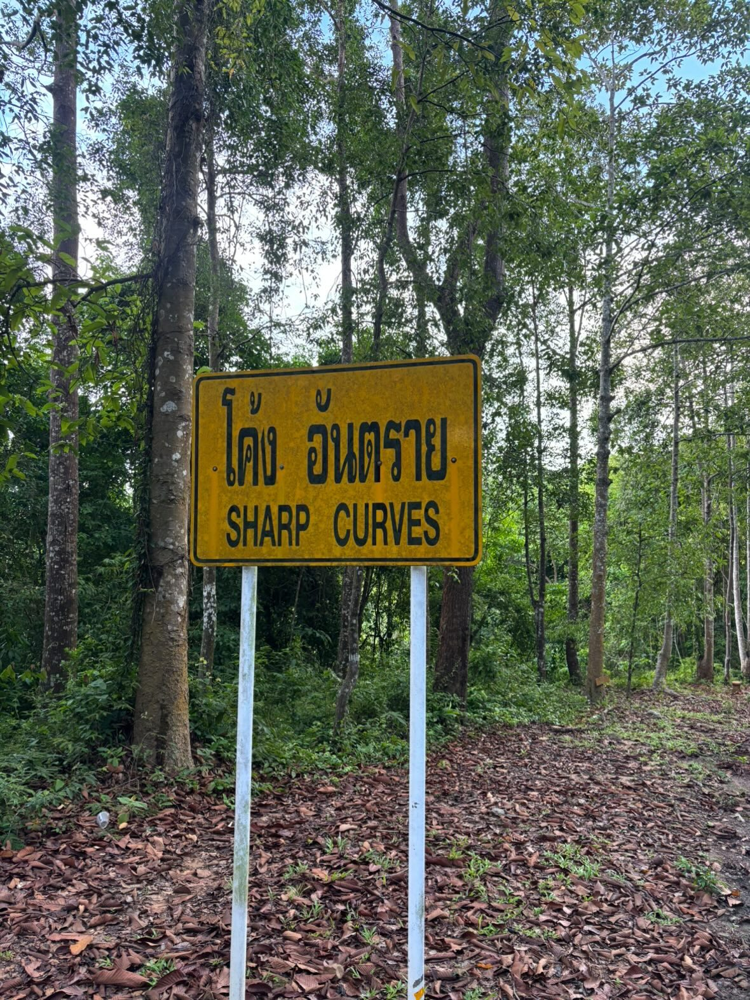
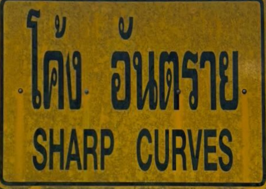

# Perpsective Transformation Playground

Usage example:

```sh
❯ python perspective_transform.py sharp-curves.jpg 
Homography M =
 [[ 1.30958395e+00  3.21652199e-02 -4.26515411e+02]
 [ 8.39922749e-02  1.30787971e+00 -8.08233664e+02]
 [ 3.02045749e-04  9.72735653e-05  1.00000000e+00]]
Output size (w, h): (446, 317)
Saved: warped.png
```

Input: 
Output: 
Demo video: 
